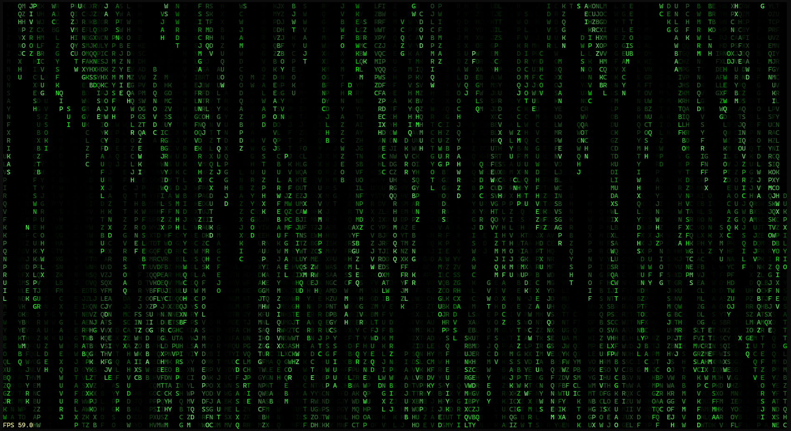

# Choto Mate

A screen saver for your terminal, in case you have a spare screen and CPU core.

## Preview

Below is the default, matrix-inspired screen saver produced by this program.



## Launching the program

You will need python with `numpy` package installed for running the classic scene. Basic launch command:

```
python choto_mate.py
```

Press **Ctrl+C** to interrupt the program.

You can examine additional options and available scenes by running:

```
python choto_mate.py --help
```

Some terminals may appear frozen after launching the program, and will not display the screen saver.
To fix, launch with `--no-buffering` option:

```
python choto_mate.py --no-buffering
```

### Video scene

You will also need to install `pygame` and `pillow` packages to launch video scene. To play bad apple video, do:

```
python choto_mate.py video videos/bad-apple.chotomate2 --audio-volume 0.5
```
